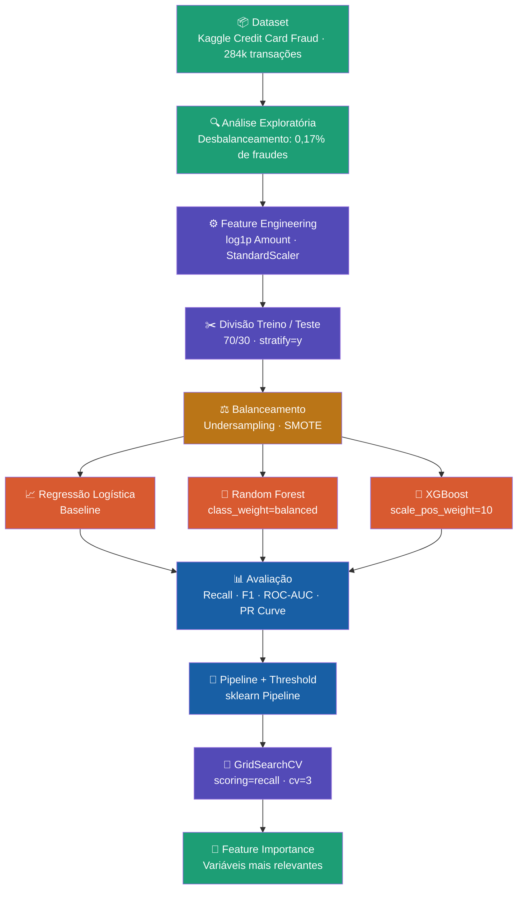

# Projeto: Detecção de Fraudes em Transações Bancárias
Este é um projeto clássico de Machine Learning supervisionado para classificação binária  
 O modelo precisa responder: essa transação é fraude (1) ou legítima (0)?

__O dataset__ usado é o famoso Credit Card Fraud Detection do Kaggle/TensorFlow.  
Ele contém transações reais de cartões de crédito europeus de 2013. As colunas são:  
V1 a V28: variáveis já transformadas por PCA (para anonimizar os dados reais de clientes)  
Amount: valor da transação  
Time: tempo em segundos desde a primeira transação  
Class: a variável alvo: 0 = legítima, 1 = fraude  

__O Problema Central:__ Desbalanceamento  
No mundo real, fraudes são rarísssimas, cerca de 0,17% das transações. Isso significa que um modelo burro que simplesmente responde "nunca é fraude" acertaria 99,83% das vezes, mas seria inútil na prática. Por isso, acurácia sozinha não basta como métrica  

__Feature Engineering:__ é o processo de criar ou transformar variáveis para ajudar o modelo a aprender melhor.  
```
df["Amount_log"] = np.log1p(df["Amount"])
```
O valor das transações tem uma distribuição muito assimétrica (a maioria é baixa, mas alguns valores são altíssimos). O log comprime essa escala, tornando a distribuição mais uniforme e o modelo mais estável.  

__Escalonamento do Amount:__
```jupyter
scaler = StandardScaler()
df["Amount_Scaled"] = scaler.fit_transform(df[["Amount"]])
```
transforma os dados para média 0 e desvio padrão 1. Algoritmos como Regressão Logística são sensíveis à escala das variáveis    
Sem isso, uma variável com valores grandes domina o aprendizado.  

__Divisão Treino/Teste:__
```
x_train, x_test, y_train, y_test = train_test_split(
    x, y, stratify=y, test_size=0.3, random_state=42
)
```
70% para treino, 30% para teste  
stratify=y: garante que a proporção de fraudes seja mantida em ambos os conjuntos.    
Sem isso, por chance o teste poderia ter quase nenhuma fraude  
random_state=42: semente para reprodutibilidade dos resultados  

__Primeiro Modelo:__ Regressão Logística  
```
model = LogisticRegression(max_iter=1000)
model.fit(x_train, y_train)
y_pres = model.predict(x_test)
```
A Regressão Logística é um modelo linear que calcula a probabilidade de cada transação ser fraude.   
É o baseline clássico, simples, interpretável, rápido.  
max_iter=1000: aumenta o número máximo de iterações do otimizador, necessário porque o dataset é grande e pode não convergir com o padrão.  

__Métricas de Avaliação:__
print(classification_report(y_test, y_pres))
| Métrica | O que mede |
| :--- | :---: |
| Precision | Dos que o modelo disse "fraude", quantos eram fraude de verdade? |
| Recall | De todas as fraudes reais, quantas o modelo detectou? |
| F1-Score | Média harmônica entre Precision e Recall |

Recall é o mais importante aqui, porque é pior deixar uma fraude passar (falso negativo) do que bloquear uma transação legítima por engano (falso positivo).  

__Curva ROC e AUC:__
```
y_probs = model.predict_proba(x_test)[:, 1]
fpr, tpr, _ = roc_curve(y_test, y_probs)
print("AUC:", roc_auc_score(y_test, y_probs))
```
predict_proba: ao invés de predizer 0 ou 1, retorna a probabilidade — [:, 1] pega a probabilidade de ser fraude  
Curva ROC plota True Positive Rate vs False Positive Rate em diferentes thresholds  
AUC (Area Under Curve): varia de 0.5 (modelo aleatório) a 1.0 (modelo perfeito). Mede a capacidade geral de separação das classes  

**Curva Precision-Recall:**
```
precision, recall, _ = precision_recall_curve(y_test, y_probs)
```
Mais útil que a ROC em datasets desbalanceados. Mostra o trade-off: aumentar o Recall geralmente reduz a Precision e vice-versa. Você escolhe o ponto da curva que faz mais sentido para o negócio.  

**Balanceamento de Dados:**  
Duas abordagens implementadas:  

__Undersampling — "reduzir os normais":__
```
fraudes = df[df["Class"] == 1]
normais = df[df["Class"] == 0].sample(n=len(fraudes), random_state=42)
df_under = pd.concat([fraudes, normais])
 ```
 Pega todas as fraudes e sorteia o mesmo número de transações legítimas. Resultado: dataset balanceado 50/50. Desvantagem: perde muito dado.  

**Oversampling com SMOTE — "criar fraudes sintéticas":**  
 ```
smote = SMOTE()
X_res, y_res = smote.fit_resample(x, y)
 ```
SMOTE (Synthetic Minority Oversampling Technique) gera novas amostras de fraude sinteticamente, interpolando entre amostras existentes. Não é cópia, são novos pontos criados entre vizinhos mais próximos. É a técnica mais usada na prática.  

**Random Forest:**
 ```
rf = RandomForestClassifier(
    n_estimators=50,
    max_depth=10,
    class_weight="balanced",
    random_state=42,
    n_jobs=-1
)
 ```
Random Forest é um exemplo de árvores de decisão.  
Cada árvore é treinada em uma amostra aleatória dos dados e features, e a predição final é a votação da maioria.  
 ```
n_estimators=50: 50 árvores no ensemble
max_depth=10: limita a profundidade para evitar overfitting
class_weight="balanced": diz ao modelo para prestar mais atenção na classe minoritária (fraudes) automaticamente — alternativa ao SMOTE
n_jobs=-1: usa todos os núcleos do processador em paralelo
 ```
**Pipeline:**
```
pipeline = Pipeline([
    ("scaler", StandardScaler()),
    ("model", LogisticRegression(max_iter=1000))
])
```
O Pipeline encadeia etapas de pré-processamento + modelo em um único objeto. Vantagens:  

Evita data leakage — o scaler é ajustado só no treino, nunca no teste  
Código mais limpo e reprodutível  
Pode ser passado direto para o GridSearch  

**Ajuste de Threshold:**
```
threshold = 0.3
y_pred_custom = (y_probs >= threshold).astype(int)
```
Por padrão, o modelo classifica como fraude se probabilidade ≥ 0.5. Aqui, o threshold é reduzido para 0.3, o que significa que o modelo fica mais "agressivo", detecta mais fraudes, mas aumenta também os falsos positivos. É uma decisão de negócio: quanto custa deixar uma fraude passar vs. bloquear um cliente legítimo?

**XGBoost:**
```
xgb = XGBClassifier(
    scale_pos_weight=10,
    use_label_encoder=False,
    eval_metric='logloss'
)
```
XGBoost é um algoritmo de gradient boosting, ao contrário do Random Forest (que treina árvores em paralelo independentes), ele treina árvores em sequência, onde cada árvore corrige os erros da anterior.  

scale_pos_weight=10: outra forma de lidar com desbalanceamento, dá peso 10x maior para os erros na classe de fraude  
É geralmente mais preciso que Random Forest, mas mais sensível a hiperparâmetros.  

**GridSearchCV — Otimização de Hiperparâmetros:**
```
param_grid = {
    "max_depth": [3, 5],
    "n_estimators": [50, 100]
}

grid = GridSearchCV(
    XGBClassifier(eval_metric="logloss", random_state=42),
    param_grid,
    scoring="recall",
    cv=3,
    n_jobs=-1
)
```
Testa todas as combinações possíveis dos hiperparâmetros (aqui: 2×2 = 4 combinações), usando cross-validation com 3 folds para cada uma. A métrica de avaliação é o Recall — porque no contexto de fraude é o que mais importa.  
cv=3 significa: o treino é dividido em 3 partes, o modelo é treinado em 2 e validado em 1, rodando 3 vezes alternando a parte de validação.  

**Importância das Variáveis (Feature Importance):**  
```
importancia = pd.DataFrame({
    'feature': x_train.columns,
    'importance': xgb.feature_importances_
}).sort_values('importance', ascending=True)
```
O XGBoost atribui uma pontuação de importância para cada variável, baseada em quantas vezes ela foi usada para fazer splits nas árvores e o quanto cada split reduziu o erro. Isso permite interpretar quais variáveis mais influenciam a detecção de fraude.  

**Fluxo geral do projeto:**  



## 📚 Guia de Estudos Interativo
[](https://github.com/MarinaSSilva/Deteccao_Anomalias/blob/main/guia_ml_fraudes.html)


